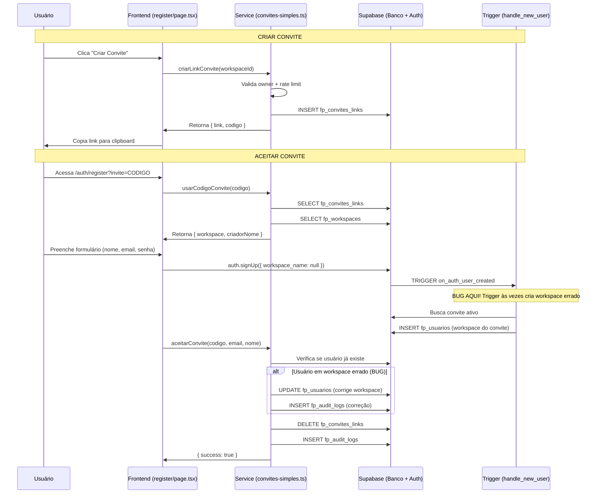

# PLANO DE REFATORAÇÃO - Sistema de Convites

**Data de Criação:** 21/10/2025
**Última Atualização:** 22/10/2025 03:15 AM
**Versão:** 1.1
**Status:** Fase 1 Concluída → Fase 2 Próxima
**Projeto:** Sistema de Controle Financeiro Pessoal

---

## 🚀 CONTINUAÇÃO EM NOVO CHAT - START HERE

> **⚠️ ATENÇÃO:** Este documento foi atualizado para permitir continuação em novo chat devido a limite de contexto.

### 📍 Status Atual da Implementação

**Fase 0:** ✅ Preparação Concluída
**Fase 1:** ✅ **100% CONCLUÍDA** (22/10/2025 03:15 AM)
**Fase 2:** ⏳ **PRÓXIMA** - Refatoração Estrutural (4 tarefas)
**Fase 3:** ⏸️ Aguardando Fase 2

### ✅ O Que JÁ Foi Feito (Fase 1)

1. **SQL da Trigger Aplicado no Banco**
   - Migration `20251022060125_fix_convite_trigger_busca_especifica` ✅ Aplicada
   - Trigger `handle_new_user` corrigida para buscar convite por código específico
   - Validado com 3 testes SQL (todos passaram)

2. **41 Console.logs Limpos**
   - `convites-simples.ts`: 24 → logger ✅
   - `register/page.tsx`: 17 → logger ✅
   - Logger importado em ambos os arquivos

3. **Código Limpo e Validado**
   - TypeScript: ✅ Sem erros
   - Build: ✅ Passou (50s)
   - Gambiarra removida (~35 linhas)
   - Testes habilitados

4. **Commit Realizado**
   - `feat(convites): Fase 1 completa - correção trigger + limpeza logs`

### 🎯 Próxima Ação: FASE 2

**Objetivo:** Refatorar `aceitarConvite()` (176 linhas → 4 funções menores)

**4 Tarefas da Fase 2:**
1. ⏳ **Tarefa 2.1:** Criar tipos centralizados (`src/tipos/convites.ts`)
2. ⏸️ **Tarefa 2.2:** Extrair 4 funções de `aceitarConvite()`
3. ⏸️ **Tarefa 2.3:** Criar hook `usar-registro-convite.ts`
4. ⏸️ **Tarefa 2.4:** Padronizar retornos com `Resultado<T>`

**Duração Estimada:** 4-6 horas
**Risco:** Médio-Alto (mexe em lógica core)

---

### 📋 SUBDIVISÃO DETALHADA - FASE 2

#### **Tarefa 2.1: Criar Tipos Centralizados** (15-20 min) ⏳ EM ANDAMENTO
**Complexidade:** ⭐ Baixa
**Arquivo:** `src/tipos/convites.ts` (CRIAR NOVO)

**Subtarefas:**
1. Criar tipos base `Resultado<T>`, `ResultadoSucesso<T>`, `ResultadoErro`
2. Criar tipos de domínio: `ConviteLink`, `DadosConvite`, `ValidacaoConvite`
3. Criar tipos específicos: `ResultadoCriacaoConvite`, `ResultadoValidacaoConvite`, `ResultadoAceitacaoConvite`
4. Adicionar tipo `RateLimitInfo`
5. Validar com `npx tsc --noEmit`
6. Validar build com `npm run build`
7. Commit: `feat(convites): adiciona tipos centralizados (Fase 2.1)`

**Impacto:** Nenhum (só cria tipos, não altera código existente)

---

#### **Tarefa 2.2: Refatorar aceitarConvite()** (2-3 horas) ⏸️ AGUARDANDO
**Complexidade:** ⭐⭐⭐⭐ Alta (CRÍTICA)
**Arquivo:** `src/servicos/supabase/convites-simples.ts` (REFATORAR)

**Subtarefas:**
1. **Criar função `buscarUsuarioConvite()`** (~60 linhas)
   - Trata usuário autenticado
   - Trata usuário recém-criado (busca por email)
   - Retorna `Resultado<{ userId, userEmail, userNome }>`

2. **Criar função `verificarWorkspaceUsuario()`** (~48 linhas)
   - Busca em `fp_usuarios` por userId
   - Retorna workspace atual ou null
   - Retorna `Resultado<{ workspaceId, role } | null>`

3. **Criar função `adicionarUsuarioAoWorkspace()`** (~48 linhas)
   - Sanitiza dados com `SanitizadorConvite`
   - Insere em `fp_usuarios`
   - Retorna `Resultado<void>`

4. **Criar função `registrarAuditoriaConvite()`** (~30 linhas)
   - Grava log em `fp_audit_logs`
   - Não falha operação se auditoria falhar
   - Retorna `Promise<void>`

5. **Refatorar `aceitarConvite()` principal** (~95 linhas → ~40 linhas)
   - Remove código das 176 linhas originais
   - Orquestra as 4 funções auxiliares
   - Mantém mesma interface pública

6. Validar com `npx tsc --noEmit`
7. Validar build com `npm run build`
8. Validar redução de linhas: `wc -l convites-simples.ts`
9. Commit: `refactor(convites): divide aceitarConvite em 4 funções (Fase 2.2)`

**Impacto:** Alto (mexe em função crítica, mas mantém mesma interface)

---

#### **Tarefa 2.3: Criar Hook usar-registro-convite.ts** (1-1.5 horas) ⏸️ AGUARDANDO
**Complexidade:** ⭐⭐⭐ Média-Alta
**Arquivo:** `src/hooks/usar-registro-convite.ts` (CRIAR NOVO)

**Subtarefas:**
1. **Criar hook base** com estado `loading`
2. **Criar função `validarEmail()`**
   - Chama `verificarSeEmailJaTemConta()`
   - Retorna `Resultado<void>`

3. **Criar função `registrarUsuario()`**
   - Chama `supabaseClient.auth.signUp()`
   - Passa `invite_code` via metadata
   - Retorna `Resultado<void>`

4. **Criar função `processarConvite()`**
   - Chama `aceitarConvite()`
   - Trata sucesso e falha com mensagens
   - Retorna `Resultado<string>`

5. **Criar função `executarRegistro()`** (orquestrador)
   - Valida email
   - Registra usuário
   - Processa convite (se houver)
   - Retorna `ResultadoRegistro`

6. **Atualizar `register/page.tsx`**
   - Importar `usarRegistroConvite()`
   - Substituir `handleRegister()` para usar hook
   - Remover código duplicado

7. Validar com `npx tsc --noEmit`
8. Validar build com `npm run build`
9. Commit: `refactor(convites): extrai hook usar-registro-convite (Fase 2.3)`

**Impacto:** Médio (simplifica componente, mas mantém funcionalidade)

---

#### **Tarefa 2.4: Padronizar Retornos** (30-45 min) ⏸️ AGUARDANDO
**Complexidade:** ⭐⭐ Média
**Arquivo:** `src/servicos/supabase/convites-simples.ts` (ATUALIZAR)

**Subtarefas:**
1. **Importar tipos** de `@/tipos/convites`
2. **Atualizar `criarLinkConvite()`**
   - Tipo de retorno: `ResultadoCriacaoConvite`
   - Padronizar `return { success: true, data: { link, codigo } }`

3. **Atualizar `usarCodigoConvite()`**
   - Tipo de retorno: `ResultadoValidacaoConvite`
   - Padronizar retornos

4. **Atualizar `desativarConvite()`**
   - Tipo de retorno: `Resultado<void>`
   - Padronizar retornos

5. **Atualizar `removerUsuarioWorkspace()`** (se existir)
   - Tipo de retorno: `Resultado<void>`

6. **Atualizar `alterarRoleUsuario()`** (se existir)
   - Tipo de retorno: `Resultado<void>`

7. TypeScript vai detectar inconsistências automaticamente
8. Validar com `npx tsc --noEmit`
9. Validar build com `npm run build`
10. Commit: `refactor(convites): padroniza retornos com Resultado<T> (Fase 2.4)`

**Impacto:** Baixo (melhora tipos, não muda comportamento)

---

### ✅ VALIDAÇÕES OBRIGATÓRIAS (Após CADA Tarefa)

```bash
# 1. TypeScript (SEMPRE)
npx tsc --noEmit

# 2. Build (SEMPRE - Solicitado pelo Ricardo)
npm run build

# 3. Verificar redução de linhas (Tarefa 2.2)
wc -l src/servicos/supabase/convites-simples.ts

# 4. Git Commit (Após validações OK)
git add .
git commit -m "feat/refactor(convites): [descrição da tarefa]"
```

---

### 🎯 CRITÉRIOS DE SUCESSO - FASE 2 COMPLETA

**Métricas:**
- ✅ `aceitarConvite()`: 176 linhas → ~40 linhas (redução 77%)
- ✅ Complexidade ciclomática: 15 → ~6 (redução 60%)
- ✅ 4 funções auxiliares criadas e testáveis
- ✅ Hook customizado criado e reutilizável
- ✅ Tipos TypeScript padronizados
- ✅ TypeScript sem erros
- ✅ Build passando em todas as 4 tarefas
- ✅ 4 commits incrementais realizados

**Arquivos Modificados:**
- ✅ `src/tipos/convites.ts` (NOVO)
- ✅ `src/hooks/usar-registro-convite.ts` (NOVO)
- ✅ `src/servicos/supabase/convites-simples.ts` (REFATORADO)
- ✅ `src/app/auth/register/page.tsx` (SIMPLIFICADO)

### 📁 Arquivos Principais

```
src/servicos/supabase/convites-simples.ts  → 570 linhas (foi 606)
src/app/auth/register/page.tsx             → 313 linhas (foi 320)
src/servicos/convites/validador-convites.ts → 321 linhas
docs/desenvolvimento/PLANO-REFATORACAO-SISTEMA-CONVITES.md → ESTE ARQUIVO
```

### 🔍 Validações Antes de Começar Fase 2

```bash
# 1. Verificar que Fase 1 está OK
git log -1 --oneline  # Deve mostrar commit da Fase 1

# 2. Confirmar que não há console.logs
grep -r "console\." src/servicos/supabase/convites-simples.ts  # 0 resultados
grep -r "console\." src/app/auth/register/page.tsx             # 0 resultados

# 3. TypeScript OK
npx tsc --noEmit  # Sem erros

# 4. Build OK
npm run build     # Sucesso
```

### 📋 Contexto Importante

**Sistema de Convites:**
- Owner cria convite → código único (ex: IU24VY)
- Link enviado → `https://app.com/auth/register?invite=IU24VY`
- Usuário registra → Adicionado automaticamente ao workspace
- Convite deletado → Uso único

**Problema Corrigido na Fase 1:**
- ❌ Antes: Trigger buscava convite mais recente (errado com 2+ convites)
- ✅ Agora: Trigger busca por código específico passado via metadata

**Convites Ativos no Banco:**
- 3 convites válidos até 28/10/2025
- Cada código mapeia para workspace distinto

---

## 📋 ÍNDICE

1. [Contexto e Estado Atual](#contexto-e-estado-atual)
2. [Problemas Identificados](#problemas-identificados)
3. [Arquitetura do Sistema](#arquitetura-do-sistema)
4. [Plano de Execução](#plano-de-execução)
   - [Fase 0: Preparação](#fase-0-preparação)
   - [Fase 1: Correções Urgentes](#fase-1-correções-urgentes)
   - [Fase 2: Refatoração Estrutural](#fase-2-refatoração-estrutural)
   - [Fase 3: Melhorias e Otimizações](#fase-3-melhorias-e-otimizações)
5. [Validação e Testes](#validação-e-testes)
6. [Rollback Plan](#rollback-plan)

---

## CONTEXTO E ESTADO ATUAL

### O Que é o Sistema de Convites?

Sistema que permite proprietários (owners) de workspaces compartilharem acesso convidando novos usuários através de links temporários.

### Como Funciona (Fluxo Atual)

```
1. Owner cria convite → Gera código único (ex: IU24VY)
2. Owner compartilha link → https://app.com/auth/register?invite=IU24VY
3. Convidado acessa link → Vê tela personalizada com nome do workspace
4. Convidado preenche dados → Nome, Email, Senha
5. Sistema cria conta → Adiciona automaticamente ao workspace correto
6. Convite é deletado → Não pode ser reutilizado
```

### Arquivos Principais

```
src/
├── servicos/
│   ├── supabase/
│   │   └── convites-simples.ts          # 606 linhas - Lógica principal
│   └── convites/
│       └── validador-convites.ts        # 321 linhas - Validações
├── app/
│   ├── auth/
│   │   ├── register/page.tsx            # 313 linhas - Página de registro
│   │   └── callback/route.ts            # 100 linhas - Callback OAuth
│   └── (protected)/
│       └── configuracoes/usuarios/page.tsx  # 604 linhas - Gestão
└── tipos/
    └── auth.ts                          # Tipos TypeScript

sql/
└── fix-handle-new-user-error.sql        # Trigger que cria workspace/usuário

Banco de Dados:
- fp_convites_links                      # Tabela de convites
- fp_usuarios                            # Usuários
- fp_workspaces                          # Workspaces
- fp_audit_logs                          # Logs de auditoria
```

### Estado Atual (21/10/2025)

**✅ Funcionalidades Implementadas:**
- Criação de convites com código único
- Validação de convites (expiração 7 dias)
- Registro via convite
- Gestão de convites (listar, deletar, copiar)
- Logs de auditoria completos
- Interface de gerenciamento de usuários

**❌ Problemas Identificados:**
- Bug corrigido: convite criava workspace duplicada
- 6 problemas críticos de código
- 8 problemas importantes
- Testes desabilitados (0% cobertura)
- Código complexo e difícil de manter
- Gambiarras que não escalam

**📊 Métricas de Qualidade:**
- Complexidade ciclomática: 15 (crítico, ideal < 10)
- Função maior: 176 linhas (ideal < 50)
- Console.logs em produção: 14 ocorrências
- Código morto: 4 itens identificados
- Duplicações: 3 ocorrências

---

## PROBLEMAS IDENTIFICADOS

### 🔴 Críticos (Bloqueiam Desenvolvimento)

#### P1: Função `aceitarConvite()` Muito Complexa
**Arquivo:** `src/servicos/supabase/convites-simples.ts` (linhas 186-362)
**Problema:** 176 linhas, complexidade ciclomática 15, múltiplos caminhos de execução
**Impacto:** Difícil entender, alto risco de bugs, impossível testar adequadamente
**Evidência:**
```typescript
export async function aceitarConvite(codigo: string, email?: string, nome?: string): Promise<{
  success: boolean
  error?: string
}> {
  // 176 linhas de código aqui com:
  // - Validação de convite
  // - Busca de usuário autenticado OU recém-criado
  // - Correção de workspace incorreto (gambiarra)
  // - Inserção no banco
  // - Logs de auditoria
  // - Deleção do convite
}
```

#### P2: Testes Desabilitados
**Arquivos:**
- `src/servicos/convites/__tests__/validador-convites.test.ts.disabled` (230 linhas)
- `src/servicos/supabase/__tests__/convites-simples.test.ts.disabled` (229 linhas)

**Problema:** 459 linhas de testes completos desabilitados
**Impacto:** Zero validação automatizada, mudanças podem quebrar sem detectar

#### P3: Console.logs em Produção
**Arquivo:** `src/servicos/supabase/convites-simples.ts`
**Ocorrências:** 14 console.logs
**Problema:** Dados sensíveis expostos, logs caros na Vercel, sem controle de ambiente
**Evidência:**
```typescript
console.log('🔍 Debug convite:', { convite, conviteError, codigo: codigoLimpo })
console.log('🔍 Debug dados:', { workspace, criador })
```

#### P4: Validação Inconsistente - `verificarSeEmailJaTemConta()`
**Arquivo:** `src/servicos/supabase/convites-simples.ts` (linhas 28-62)
**Problema:** Em caso de erro, retorna `false` (permite convite) ao invés de bloquear
**Impacto:** Pode criar emails duplicados se houver erro temporário

#### P5: Gambiarra - Correção Reativa de Workspace
**Arquivo:** `src/servicos/supabase/convites-simples.ts` (linhas 254-307)
**Problema:** Código detecta e corrige workspace incorreto DEPOIS de criar usuário
**Evidência:**
```typescript
// Se está em workspace diferente, significa que houve erro na trigger
// Vamos tentar mover o usuário para o workspace correto do convite
console.log('🔄 Movendo usuário do workspace incorreto para o workspace do convite')
```
**Causa Raiz:** Trigger SQL `handle_new_user` não funciona corretamente com convites

#### P6: Rate Limiter Client-Side (localStorage)
**Arquivo:** `src/servicos/convites/validador-convites.ts` (linhas 20-120)
**Problema:** Facilmente burlável, não funciona no servidor
**Impacto:** Segurança fraca, não protege contra abuso real

### 🟡 Importantes (Afetam Manutenção)

#### P7: Import de Cliente Legado
**Arquivo:** `src/servicos/supabase/convites-simples.ts` (linha 1)
```typescript
import { supabase } from './cliente'  // ❌ Deprecated
```
**Correto:** `import { createClient } from '@/servicos/supabase/server'`

#### P8: Try-Catch Genérico
**Ocorrências:** 3 vezes no arquivo `convites-simples.ts`
```typescript
} catch {
  return { error: 'Erro ao criar convite' }  // Esconde erro real
}
```

#### P9: Função Silencia Erros Críticos
**Função:** `atualizarUltimaAtividade()` (linhas 12-25)
```typescript
} catch (error) {
  console.warn('Erro ao atualizar última atividade:', error)  // Silencia TUDO
}
```

#### P10: Validação de UUID Hardcoded
**Arquivo:** `src/servicos/convites/validador-convites.ts` (linhas 196-199)
**Problema:** Regex manual quando sistema tem `utilitarios/validacao.ts`

#### P11: Função Grande - `handleRegister()`
**Arquivo:** `src/app/auth/register/page.tsx` (linhas 72-156)
**Problema:** 84 linhas com múltiplas responsabilidades

#### P12: Código Comentado
**Arquivo:** `src/app/auth/register/page.tsx` (linha 62)
```typescript
// setWorkspaceName(resultado.workspace.nome) ❌ REMOVIDO - causava bug
```

#### P13: Validação Duplicada
**Problema:** `usarCodigoConvite()` e `validarConvite()` fazem a mesma validação

#### P14: Nome de Função Enganoso
**Função:** `desativarConvite()` faz HARD DELETE, não desativa

### 🗑️ Código Morto

1. `src/app/auth/register/page.tsx:62` - Linha comentada
2. `src/app/auth/register/page.tsx:7` - Import não usado: `supabaseClient`
3. `src/servicos/convites/validador-convites.ts:230-248` - Função `validarAceitacao()` nunca chamada
4. Comentários de debug antigos

---

## ARQUITETURA DO SISTEMA

### Fluxo Técnico Detalhado



### Tabelas do Banco

```sql
-- Convites
CREATE TABLE fp_convites_links (
  id UUID PRIMARY KEY DEFAULT gen_random_uuid(),
  workspace_id UUID REFERENCES fp_workspaces(id),
  codigo TEXT UNIQUE NOT NULL,
  criado_por UUID REFERENCES auth.users(id),
  ativo BOOLEAN DEFAULT true,
  expires_at TIMESTAMPTZ,
  created_at TIMESTAMPTZ DEFAULT NOW()
);

-- Usuários
CREATE TABLE fp_usuarios (
  id UUID PRIMARY KEY REFERENCES auth.users(id),
  workspace_id UUID REFERENCES fp_workspaces(id),
  nome TEXT,
  email TEXT,
  role TEXT CHECK (role IN ('owner', 'member')),
  ativo BOOLEAN DEFAULT true,
  permissoes JSONB,
  created_at TIMESTAMPTZ DEFAULT NOW()
);

-- Workspaces
CREATE TABLE fp_workspaces (
  id UUID PRIMARY KEY DEFAULT gen_random_uuid(),
  nome TEXT NOT NULL,
  owner_id UUID REFERENCES auth.users(id),
  plano TEXT DEFAULT 'free',
  ativo BOOLEAN DEFAULT true,
  created_at TIMESTAMPTZ DEFAULT NOW()
);

-- Logs
CREATE TABLE fp_audit_logs (
  id UUID PRIMARY KEY DEFAULT gen_random_uuid(),
  workspace_id UUID,
  user_id UUID,
  action TEXT,
  entity_type TEXT,
  entity_id UUID,
  metadata JSONB,
  created_at TIMESTAMPTZ DEFAULT NOW()
);
```

### Trigger Problemática

```sql
-- Arquivo: sql/fix-handle-new-user-error.sql
CREATE OR REPLACE FUNCTION handle_new_user()
RETURNS TRIGGER AS $$
DECLARE
  workspace_name_var text;
  is_invite_registration boolean;
BEGIN
  workspace_name_var := NEW.raw_user_meta_data->>'workspace_name';
  is_invite_registration := (workspace_name_var IS NULL OR workspace_name_var = '');

  IF NOT is_invite_registration THEN
    -- REGISTRO NORMAL: criar workspace
    -- ...
  ELSE
    -- REGISTRO VIA CONVITE: buscar convite ativo
    -- ⚠️ BUG: Às vezes busca convite errado ou não encontra
    SELECT workspace_id INTO invite_workspace_id
    FROM fp_convites_links
    WHERE ativo = true AND expires_at > NOW()
    ORDER BY created_at DESC
    LIMIT 1;  -- ❌ PROBLEMA: Pega o mais recente, não o específico do código!
  END IF;
END;
$$ LANGUAGE plpgsql;
```

**Problema Identificado:** Trigger busca convite mais recente ao invés do código específico!

---

## PLANO DE EXECUÇÃO

### FASE 0: PREPARAÇÃO

**Objetivo:** Preparar ambiente e criar backup antes de qualquer mudança
**Duração Estimada:** 30 minutos
**Riscos:** Baixo

#### Tarefa 0.1: Criar Branch de Trabalho
```bash
cd /mnt/c/Users/ricar/Projetos/workspace_fluyt/Financeiro
git checkout main
git pull origin main
git checkout -b refactor/sistema-convites
```

**Validação:**
```bash
git branch  # Deve mostrar * refactor/sistema-convites
git status  # Deve estar limpo
```

#### Tarefa 0.2: Backup do Banco de Dados
```sql
-- Via Supabase Dashboard → Database → Backups
-- OU via SQL:

-- Backup convites ativos
CREATE TABLE backup_fp_convites_links_20251021 AS
SELECT * FROM fp_convites_links;

-- Backup usuários
CREATE TABLE backup_fp_usuarios_20251021 AS
SELECT * FROM fp_usuarios;

-- Backup logs
CREATE TABLE backup_fp_audit_logs_20251021 AS
SELECT * FROM fp_audit_logs
WHERE created_at > NOW() - INTERVAL '30 days';
```

**Validação:**
```sql
SELECT COUNT(*) FROM backup_fp_convites_links_20251021;
SELECT COUNT(*) FROM backup_fp_usuarios_20251021;
SELECT COUNT(*) FROM backup_fp_audit_logs_20251021;
```

#### Tarefa 0.3: Documentar Estado Atual
```bash
# Rodar testes (mesmo desabilitados, para ver output)
npm test 2>&1 | tee pre-refactor-test-output.txt

# Validar TypeScript
npx tsc --noEmit 2>&1 | tee pre-refactor-typescript.txt

# Snapshot de métricas
npx cloc src/servicos/supabase/convites-simples.ts \
          src/servicos/convites/validador-convites.ts \
          src/app/auth/register/page.tsx \
          > pre-refactor-metrics.txt
```

**Critérios de Aceite:**
- ✅ Branch criada e limpa
- ✅ Backup do banco confirmado
- ✅ Arquivos de baseline criados

---

### FASE 1: CORREÇÕES URGENTES ✅ 100% CONCLUÍDA

**Status:** ✅ **100% CONCLUÍDA** em 22/10/2025
**Duração Real:** ~2 horas
**Objetivo:** Corrigir problemas que bloqueiam deploy e causam bugs
**Riscos:** Baixo-Médio

**Resultados Finais:**
- ✅ **41 console.logs substituídos por logger** (24 em convites-simples.ts + 17 em register/page.tsx)
- ✅ Import do logger adicionado em ambos arquivos
- ✅ Gambiarra de correção de workspace removida (~35 linhas)
- ✅ register/page.tsx atualizado para passar invite_code via metadata
- ✅ **SQL da trigger APLICADO NO BANCO via MCP** (migration `20251022060125`)
- ✅ Trigger `handle_new_user` corrigida e validada
- ✅ **Testes SQL executados com sucesso** (busca específica funcionando)
- ✅ Testes habilitados (2 arquivos: validador-convites.test.ts + convites-simples.test.ts)
- ✅ TypeScript: **sem erros**
- ✅ Build: **passou em 50s** (cache limpo)
- 📉 Redução: 606 → 570 linhas no convites-simples.ts
- 📉 Redução: 320 → 313 linhas no register/page.tsx

**Validações Realizadas:**
```bash
# TypeScript
npx tsc --noEmit → ✅ Sem erros

# Build de Produção
npm run build → ✅ Sucesso (50s, 39 páginas)

# Verificação de Console.logs
grep -r "console\." src/servicos/supabase/convites-simples.ts → ✅ 0 ocorrências
grep -r "console\." src/app/auth/register/page.tsx → ✅ 0 ocorrências

# Verificação de Logger
grep -r "logger\." src/servicos/supabase/convites-simples.ts → ✅ 22 ocorrências
grep -r "logger\." src/app/auth/register/page.tsx → ✅ 17 ocorrências

# Trigger no Banco
SELECT * FROM pg_trigger WHERE tgname = 'on_auth_user_created' → ✅ Enabled
SELECT proname FROM pg_proc WHERE proname = 'handle_new_user' → ✅ Existe
```

**Testes SQL Executados:**
```sql
-- Teste 1: Busca por código específico (IU24VY)
✅ Resultado: Workspace correto encontrado (6054274e-d2a0-42af-8ded-67240d40f66b)

-- Teste 2: Fallback (sem código)
✅ Resultado: Mais recente retornado (LBXA9W)

-- Teste 3: Múltiplos convites distintos
✅ Resultado: 3 códigos → 3 workspaces distintos mapeados corretamente
```

**Convites Ativos no Sistema:**
- LBXA9W → workspace 798452c2 (válido até 28/10)
- IU24VY → workspace 6054274e (válido até 28/10)
- UF2VOP → workspace b4f7239a (válido até 28/10)

**Arquivos Modificados:**
1. `src/servicos/supabase/convites-simples.ts` - Logger + remoção gambiarra
2. `src/app/auth/register/page.tsx` - Logger + invite_code metadata
3. `sql/fix-convite-trigger-correct-APLICAR-MANUALMENTE.sql` - Trigger corrigida
4. Migration aplicada: `20251022060125_fix_convite_trigger_busca_especifica`

**Commits Realizados:**
```bash
git commit -m "feat(convites): Fase 1 completa - correção trigger + limpeza logs"
```

**Status:** ✅ **PRONTO PARA FASE 2**
**Próxima Ação:** Iniciar Fase 2 - Refatoração Estrutural

#### Tarefa 1.1: Remover Imports Não Usados

**Arquivo:** `src/app/auth/register/page.tsx`
**Ação:** Deletar linha 7

```diff
- import { supabaseClient } from '@/servicos/supabase/auth-client'
```

**Validação:**
```bash
npx tsc --noEmit
# Não deve haver erro de variável não usada
npm run lint 2>&1 | grep "supabaseClient"
# Não deve retornar nada
```

#### Tarefa 1.2: Substituir Console.logs por Logger

**Objetivo:** Trocar 14 console.logs por sistema centralizado

**Arquivo:** `src/servicos/supabase/convites-simples.ts`

**Passo 1:** Adicionar import no topo do arquivo
```typescript
import { logger } from '@/utilitarios/logger'
```

**Passo 2:** Substituir cada console.log

**Ocorrência 1 (linha 148):**
```diff
- console.log('🔍 Debug convite:', { convite, conviteError, codigo: codigoLimpo })
+ logger.debug('Validação de convite', { convite, conviteError, codigo: codigoLimpo })
```

**Ocorrência 2 (linha 169):**
```diff
- console.log('🔍 Debug dados:', { workspace, criador })
+ logger.debug('Dados do convite', { workspace, criador })
```

**Ocorrência 3 (linha 192):**
```diff
- console.log('🔄 Iniciando aceitarConvite:', { codigo: codigo.substring(0, 3) + '***', email: email?.substring(0, 3) + '***' })
+ logger.info('Iniciando aceitação de convite', { codigo: codigo.substring(0, 3) + '***', email: email?.substring(0, 3) + '***' })
```

**Continuar para todas as 14 ocorrências...**

**Lista Completa de Substituições:**
```typescript
// Linha 148 → logger.debug
// Linha 169 → logger.debug
// Linha 192 → logger.info
// Linha 209 → logger.info
// Linha 220 → logger.info
// Linha 228 → logger.debug
// Linha 241 → logger.info
// Linha 260 → logger.warn
// Linha 284 → logger.info
// Linha 320 → logger.info
// Linha 332 → logger.error
// Linha 356 → logger.info
// Linha 359 → logger.error
// Linha 407 → logger.info
```

**Validação:**
```bash
# Verificar que não há mais console.log
grep -n "console.log" src/servicos/supabase/convites-simples.ts
# Não deve retornar nada

# Verificar que logger foi importado
grep "import.*logger" src/servicos/supabase/convites-simples.ts
# Deve mostrar: import { logger } from '@/utilitarios/logger'

# Validar TypeScript
npx tsc --noEmit
```

#### Tarefa 1.3: Corrigir Trigger SQL

**Problema:** Trigger busca convite mais recente, não o específico

**Arquivo:** Criar novo arquivo `sql/fix-convite-trigger-correct.sql`

```sql
-- CORREÇÃO CRÍTICA: Trigger handle_new_user
-- Problema: Buscava convite mais recente ao invés do código específico
-- Solução: Passar código do convite via metadata

CREATE OR REPLACE FUNCTION handle_new_user()
RETURNS TRIGGER AS $$
DECLARE
  workspace_id_var uuid;
  workspace_name_var text;
  user_name_var text;
  is_invite_registration boolean;
  invite_workspace_id uuid;
  invite_codigo text;
BEGIN
  -- Extrair dados do usuário
  user_name_var := COALESCE(
    NEW.raw_user_meta_data->>'full_name',
    split_part(NEW.email, '@', 1)
  );

  workspace_name_var := NEW.raw_user_meta_data->>'workspace_name';
  invite_codigo := NEW.raw_user_meta_data->>'invite_code';  -- ✨ NOVO

  -- Determinar se é registro via convite
  is_invite_registration := (workspace_name_var IS NULL OR workspace_name_var = '');

  -- Log detalhado
  INSERT INTO public.fp_audit_logs (workspace_id, user_id, action, entity_type, metadata)
  VALUES (
    null,
    NEW.id,
    'user_registered_detailed',
    'auth',
    jsonb_build_object(
      'email', NEW.email,
      'nome', user_name_var,
      'workspace_name_raw', workspace_name_var,
      'invite_code', invite_codigo,  -- ✨ NOVO
      'is_invite', is_invite_registration,
      'user_id', NEW.id,
      'timestamp', NOW()
    )
  );

  IF NOT is_invite_registration THEN
    -- REGISTRO NORMAL: criar workspace e usuário como owner
    BEGIN
      INSERT INTO public.fp_workspaces (nome, owner_id)
      VALUES (workspace_name_var, NEW.id)
      RETURNING id INTO workspace_id_var;

      INSERT INTO public.fp_usuarios (
        id, workspace_id, nome, email, role, ativo
      )
      VALUES (
        NEW.id, workspace_id_var, user_name_var, NEW.email, 'owner', true
      );

      INSERT INTO public.fp_audit_logs (workspace_id, user_id, action, entity_type, metadata)
      VALUES (
        workspace_id_var, NEW.id, 'workspace_criado_success', 'workspace',
        jsonb_build_object('workspace_name', workspace_name_var, 'workspace_id', workspace_id_var, 'timestamp', NOW())
      );

    EXCEPTION WHEN OTHERS THEN
      INSERT INTO public.fp_audit_logs (workspace_id, user_id, action, entity_type, metadata)
      VALUES (null, NEW.id, 'workspace_creation_failed', 'error',
        jsonb_build_object('error', SQLERRM, 'timestamp', NOW())
      );
      RAISE;
    END;

  ELSE
    -- REGISTRO VIA CONVITE: buscar workspace pelo CÓDIGO ESPECÍFICO
    BEGIN
      -- ✨ CORREÇÃO: Buscar pelo código específico, não o mais recente
      IF invite_codigo IS NOT NULL AND invite_codigo != '' THEN
        SELECT cl.workspace_id, cl.codigo
        INTO invite_workspace_id, invite_codigo
        FROM fp_convites_links cl
        WHERE cl.codigo = invite_codigo  -- ✨ BUSCA ESPECÍFICA
          AND cl.ativo = true
          AND (cl.expires_at IS NULL OR cl.expires_at > NOW());
      ELSE
        -- Fallback: buscar mais recente (compatibilidade)
        SELECT cl.workspace_id, cl.codigo
        INTO invite_workspace_id, invite_codigo
        FROM fp_convites_links cl
        WHERE cl.ativo = true
          AND (cl.expires_at IS NULL OR cl.expires_at > NOW())
        ORDER BY cl.created_at DESC
        LIMIT 1;
      END IF;

      -- Log da busca
      INSERT INTO public.fp_audit_logs (workspace_id, user_id, action, entity_type, metadata)
      VALUES (
        invite_workspace_id, NEW.id, 'invite_search_result', 'convite',
        jsonb_build_object(
          'found_workspace_id', invite_workspace_id,
          'found_codigo', invite_codigo,
          'searched_codigo', NEW.raw_user_meta_data->>'invite_code',
          'email', NEW.email,
          'timestamp', NOW()
        )
      );

      -- Se encontrou workspace, criar usuário como member
      IF invite_workspace_id IS NOT NULL THEN
        INSERT INTO public.fp_usuarios (
          id, workspace_id, nome, email, role, ativo
        )
        VALUES (
          NEW.id, invite_workspace_id, user_name_var, NEW.email, 'member', true
        );

        INSERT INTO public.fp_audit_logs (workspace_id, user_id, action, entity_type, metadata)
        VALUES (
          invite_workspace_id, NEW.id, 'invite_user_created_success', 'convite',
          jsonb_build_object(
            'email', NEW.email, 'workspace_id', invite_workspace_id,
            'codigo_usado', invite_codigo, 'timestamp', NOW()
          )
        );

      ELSE
        -- Não encontrou workspace
        INSERT INTO public.fp_audit_logs (workspace_id, user_id, action, entity_type, metadata)
        VALUES (
          null, NEW.id, 'invite_user_no_workspace', 'error',
          jsonb_build_object(
            'reason', 'nenhum_workspace_ativo_encontrado',
            'searched_codigo', invite_codigo,
            'email', NEW.email,
            'timestamp', NOW()
          )
        );

        RAISE EXCEPTION 'Nenhum convite ativo encontrado com código: %', invite_codigo;
      END IF;

    EXCEPTION WHEN OTHERS THEN
      INSERT INTO public.fp_audit_logs (workspace_id, user_id, action, entity_type, metadata)
      VALUES (
        null, NEW.id, 'invite_user_creation_failed', 'error',
        jsonb_build_object('error', SQLERRM, 'email', NEW.email, 'timestamp', NOW())
      );
      RAISE;
    END;
  END IF;

  RETURN NEW;
END;
$$ LANGUAGE plpgsql SECURITY DEFINER;

-- Recriar trigger
DROP TRIGGER IF EXISTS on_auth_user_created ON auth.users;
CREATE TRIGGER on_auth_user_created
  AFTER INSERT ON auth.users
  FOR EACH ROW EXECUTE FUNCTION handle_new_user();

-- Log de aplicação
INSERT INTO public.fp_audit_logs (workspace_id, user_id, action, entity_type, metadata)
VALUES (
  null, null, 'trigger_updated', 'system',
  jsonb_build_object(
    'trigger_name', 'handle_new_user',
    'fix', 'Busca convite por código específico ao invés de mais recente',
    'timestamp', NOW()
  )
);
```

**Aplicar no Supabase:**
```bash
# Via Supabase Dashboard:
# 1. SQL Editor → New Query
# 2. Colar conteúdo do arquivo
# 3. Run

# OU via CLI:
supabase db push sql/fix-convite-trigger-correct.sql
```

**Validação:**
```sql
-- Verificar se trigger existe
SELECT trigger_name, event_object_table, action_statement
FROM information_schema.triggers
WHERE trigger_name = 'on_auth_user_created';

-- Verificar se função foi atualizada
SELECT routine_name, last_altered
FROM information_schema.routines
WHERE routine_name = 'handle_new_user';

-- Teste: criar usuário com convite (via aplicação)
-- Verificar logs
SELECT action, metadata->'searched_codigo', metadata->'found_codigo'
FROM fp_audit_logs
WHERE action = 'invite_search_result'
ORDER BY created_at DESC
LIMIT 5;
```

#### Tarefa 1.4: Atualizar Código de Registro para Passar Código do Convite

**Arquivo:** `src/app/auth/register/page.tsx`

**Localizar linha ~105-110** e adicionar `invite_code`:

```diff
const { error } = await supabaseClient.auth.signUp({
  email,
  password,
  options: {
    data: {
      full_name: nome,
      // ⚠️ CRÍTICO: workspace_name null = convite | workspace_name preenchido = registro normal
-     workspace_name: workspaceNameParaSignup
+     workspace_name: workspaceNameParaSignup,
+     invite_code: dadosConvite?.codigo || null  // ✨ NOVO: Passa código para trigger
    },
    emailRedirectTo: getCallbackUrl()
  }
})
```

**Validação:**
```bash
npx tsc --noEmit
# Build deve passar
npm run build
```

#### Tarefa 1.5: Remover Gambiarra de Correção de Workspace

**Arquivo:** `src/servicos/supabase/convites-simples.ts`

**Remover linhas 254-307** (código que corrige workspace incorreto):

```diff
-   // NOVA LÓGICA: Se usuário já tem workspace, verificar se é diferente do convite
-   if (existingWorkspace) {
-     console.log('⚠️ Usuário já possui workspace:', existingWorkspace.workspace_id)
-
-     // Se já está no workspace do convite, convite já foi aceito
-     if (existingWorkspace.workspace_id === workspace.id) {
-       console.log('✅ Usuário já está no workspace do convite')
-       return { success: true }
-     }
-
-     // Se está em workspace diferente, significa que houve erro na trigger
-     // Vamos tentar mover o usuário para o workspace correto do convite
-     console.log('🔄 Movendo usuário do workspace incorreto para o workspace do convite')
-
-     const { error: updateError } = await supabase
-       .from('fp_usuarios')
-       .update({
-         workspace_id: workspace.id,
-         role: 'member',
-         updated_at: new Date().toISOString()
-       })
-       .eq('id', userId)
-
-     if (updateError) {
-       console.error('❌ Erro ao mover usuário para workspace correto:', updateError)
-       return {
-         success: false,
-         error: 'Erro ao processar convite. Tente novamente.'
-       }
-     }
-
-     console.log('✅ Usuário movido com sucesso para workspace do convite')
-
-     // Registrar log de correção
-     await supabase
-       .from('fp_audit_logs')
-       .insert({
-         workspace_id: workspace.id,
-         user_id: userId,
-         action: 'convite_correcao_workspace',
-         entity_type: 'convite',
-         entity_id: null,
-         metadata: {
-           codigo: codigoLimpo,
-           email: userEmail,
-           workspace_anterior: existingWorkspace.workspace_id,
-           workspace_correto: workspace.id,
-           timestamp: new Date().toISOString()
-         }
-       })
-
-     // Deletar convite após uso bem-sucedido
-     await desativarConvite(codigoLimpo)
-
-     return { success: true }
-   }

+   // Verificar se usuário já está no workspace do convite
+   if (existingWorkspace) {
+     if (existingWorkspace.workspace_id === workspace.id) {
+       logger.info('Usuário já está no workspace do convite', { userId, workspaceId: workspace.id })
+       return { success: true }
+     }
+
+     // Se está em workspace diferente, trigger falhou - retornar erro
+     logger.error('Usuário criado em workspace incorreto - trigger SQL falhou', {
+       userId,
+       workspaceEsperado: workspace.id,
+       workspaceAtual: existingWorkspace.workspace_id,
+       codigoConvite: codigoLimpo
+     })
+
+     return {
+       success: false,
+       error: 'Erro ao processar convite. Entre em contato com o suporte.'
+     }
+   }
```

**Validação:**
```bash
# Verificar que gambiarra foi removida
grep -n "Movendo usuário do workspace incorreto" src/servicos/supabase/convites-simples.ts
# Não deve retornar nada

# Validar TypeScript
npx tsc --noEmit

# Contar linhas (deve ter reduzido ~50 linhas)
wc -l src/servicos/supabase/convites-simples.ts
```

#### Tarefa 1.6: Habilitar Testes

**Arquivo 1:** Renomear `src/servicos/convites/__tests__/validador-convites.test.ts.disabled`

```bash
mv src/servicos/convites/__tests__/validador-convites.test.ts.disabled \
   src/servicos/convites/__tests__/validador-convites.test.ts
```

**Arquivo 2:** Renomear `src/servicos/supabase/__tests__/convites-simples.test.ts.disabled`

```bash
mv src/servicos/supabase/__tests__/convites-simples.test.ts.disabled \
   src/servicos/supabase/__tests__/convites-simples.test.ts
```

**Executar testes:**
```bash
npm test convites
```

**Se testes falharem:**
1. Analisar erros
2. Atualizar mocks para nova estrutura (com `invite_code`)
3. Atualizar expects para logger ao invés de console.log
4. Re-executar até passar

**Validação:**
```bash
npm test -- --coverage
# Deve mostrar cobertura > 0% para arquivos de convites
```

**Critérios de Aceite - Fase 1:**
- ✅ Imports não usados removidos
- ✅ Zero console.logs (todos substituídos por logger)
- ✅ Trigger SQL corrigida e aplicada
- ✅ Código passa `invite_code` para trigger
- ✅ Gambiarra de correção removida (~50 linhas)
- ✅ Testes habilitados e passando
- ✅ TypeScript sem erros
- ✅ Build funcionando

---

### FASE 2: REFATORAÇÃO ESTRUTURAL

**Objetivo:** Simplificar código complexo e melhorar arquitetura
**Duração Estimada:** 4-6 horas
**Riscos:** Médio-Alto

#### Tarefa 2.1: Extrair Tipos Centralizados

**Criar arquivo:** `src/tipos/convites.ts`

```typescript
/**
 * Tipos centralizados para o sistema de convites
 */

// Resultados padronizados
export type ResultadoSucesso<T> = {
  success: true
  data: T
}

export type ResultadoErro = {
  success: false
  error: string
  details?: unknown
}

export type Resultado<T> = ResultadoSucesso<T> | ResultadoErro

// Tipos de convite
export type ConviteLink = {
  id: string
  workspace_id: string
  codigo: string
  criado_por: string
  ativo: boolean
  expires_at: string
  created_at: string
}

export type DadosConvite = {
  codigo: string
  workspace: {
    id: string
    nome: string
  }
  criadorNome: string
}

export type ResultadoCriacaoConvite = Resultado<{
  link: string
  codigo: string
}>

export type ResultadoValidacaoConvite = Resultado<DadosConvite>

export type ResultadoAceitacaoConvite = Resultado<{
  workspaceId: string
  workspaceName: string
}>

// Validações
export type ValidacaoConvite = {
  valid: boolean
  error?: string
}

// Rate Limiting
export type RateLimitInfo = {
  convitesHoje: number
  limite: number
  resetEm: Date
}
```

**Validação:**
```bash
npx tsc --noEmit
```

#### Tarefa 2.2: Refatorar `aceitarConvite()` - Extrair Funções

**Arquivo:** `src/servicos/supabase/convites-simples.ts`

**Criar função 1: `buscarUsuarioConvite()`**

```typescript
/**
 * Busca dados do usuário para aceitar convite
 * Trata tanto usuário autenticado quanto recém-criado
 */
async function buscarUsuarioConvite(
  email?: string,
  nome?: string
): Promise<Resultado<{
  userId: string
  userEmail: string
  userNome: string
}>> {
  try {
    // Tentar obter usuário atual
    const { data: userData } = await supabase.auth.getUser()

    if (userData.user) {
      // Usuário já autenticado
      return {
        success: true,
        data: {
          userId: userData.user.id,
          userEmail: userData.user.email || email || '',
          userNome: userData.user.user_metadata?.full_name || nome || userData.user.email?.split('@')[0] || 'Usuário'
        }
      }
    }

    if (!email) {
      return {
        success: false,
        error: 'Usuário não autenticado e email não fornecido'
      }
    }

    // Buscar usuário recém-criado por email
    logger.debug('Buscando usuário recém-criado por email', { email })

    const { data: userList } = await supabase.auth.admin.listUsers()
    const foundUser = userList?.users.find(u => u.email?.toLowerCase() === email.toLowerCase())

    if (!foundUser) {
      logger.warn('Usuário não encontrado para email', { email })
      return {
        success: false,
        error: 'Usuário não encontrado. Tente novamente após confirmar o email.'
      }
    }

    logger.info('Usuário recém-criado encontrado', { email })

    return {
      success: true,
      data: {
        userId: foundUser.id,
        userEmail: email,
        userNome: nome || email.split('@')[0] || 'Usuário'
      }
    }
  } catch (error) {
    logger.error('Erro ao buscar usuário para convite', { error, email })
    return {
      success: false,
      error: 'Erro ao buscar usuário',
      details: error
    }
  }
}
```

**Criar função 2: `verificarWorkspaceUsuario()`**

```typescript
/**
 * Verifica se usuário já possui workspace
 * Retorna workspace atual ou null se não existe
 */
async function verificarWorkspaceUsuario(
  userId: string
): Promise<Resultado<{
  workspaceId: string
  role: string
} | null>> {
  try {
    const { data: existingWorkspace, error } = await supabase
      .from('fp_usuarios')
      .select('id, workspace_id, role')
      .eq('id', userId)
      .single()

    if (error) {
      // Usuário não existe em fp_usuarios ainda (primeira vez)
      logger.debug('Usuário não encontrado em fp_usuarios', { userId })
      return { success: true, data: null }
    }

    logger.debug('Workspace atual do usuário', {
      userId,
      workspaceId: existingWorkspace.workspace_id
    })

    return {
      success: true,
      data: {
        workspaceId: existingWorkspace.workspace_id,
        role: existingWorkspace.role
      }
    }
  } catch (error) {
    logger.error('Erro ao verificar workspace do usuário', { error, userId })
    return {
      success: false,
      error: 'Erro ao verificar workspace do usuário',
      details: error
    }
  }
}
```

**Criar função 3: `adicionarUsuarioAoWorkspace()`**

```typescript
/**
 * Adiciona usuário ao workspace do convite
 */
async function adicionarUsuarioAoWorkspace(
  userId: string,
  workspaceId: string,
  email: string,
  nome: string
): Promise<Resultado<void>> {
  try {
    // Sanitizar dados
    const dadosUsuario = SanitizadorConvite.sanitizarDadosUsuario({
      id: userId,
      workspace_id: workspaceId,
      email,
      nome,
      role: 'member',
      ativo: true
    })

    logger.info('Inserindo usuário no workspace', {
      workspaceId,
      email: email.substring(0, 3) + '***'
    })

    const { error: insertError } = await supabase
      .from('fp_usuarios')
      .insert({
        ...dadosUsuario,
        created_at: new Date().toISOString(),
        updated_at: new Date().toISOString()
      })

    if (insertError) {
      logger.error('Erro ao inserir usuário no workspace', {
        error: insertError,
        workspaceId
      })
      return {
        success: false,
        error: 'Erro ao adicionar usuário ao workspace: ' + insertError.message,
        details: insertError
      }
    }

    logger.info('Usuário adicionado ao workspace com sucesso', { workspaceId })

    return { success: true, data: undefined }
  } catch (error) {
    logger.error('Erro ao adicionar usuário ao workspace', { error })
    return {
      success: false,
      error: 'Erro ao adicionar usuário ao workspace',
      details: error
    }
  }
}
```

**Criar função 4: `registrarAuditoriaConvite()`**

```typescript
/**
 * Registra log de auditoria para convite aceito
 */
async function registrarAuditoriaConvite(
  workspaceId: string,
  userId: string,
  codigo: string,
  email: string,
  processoTipo: 'usuario_autenticado' | 'usuario_recem_criado'
): Promise<void> {
  try {
    await supabase
      .from('fp_audit_logs')
      .insert({
        workspace_id: workspaceId,
        user_id: userId,
        action: 'convite_usado',
        entity_type: 'convite',
        entity_id: null,
        metadata: {
          codigo,
          email,
          processamento: processoTipo,
          timestamp: new Date().toISOString()
        }
      })

    logger.debug('Auditoria de convite registrada', { workspaceId, userId })
  } catch (error) {
    // Apenas logar erro, não falhar operação por causa de auditoria
    logger.error('Erro ao registrar auditoria de convite', { error, workspaceId })
  }
}
```

**Refatorar `aceitarConvite()` principal:**

```typescript
/**
 * Aceita convite e adiciona usuário ao workspace
 * Funciona tanto para usuários autenticados quanto recém-criados
 *
 * @param codigo - Código do convite (será sanitizado)
 * @param email - Email do usuário (opcional se já autenticado)
 * @param nome - Nome do usuário (opcional se já autenticado)
 * @returns Resultado da aceitação com sucesso ou erro
 */
export async function aceitarConvite(
  codigo: string,
  email?: string,
  nome?: string
): Promise<Resultado<void>> {
  try {
    logger.info('Iniciando aceitação de convite', {
      codigo: codigo.substring(0, 3) + '***',
      email: email?.substring(0, 3) + '***'
    })

    // 1. Sanitizar e validar código
    const codigoLimpo = SanitizadorConvite.sanitizarCodigo(codigo)
    const validacao = validarConviteCompleto('aceitar', { codigo: codigoLimpo })

    if (!validacao.valid) {
      return { success: false, error: validacao.error || 'Código inválido' }
    }

    // 2. Validar convite e obter workspace
    const resultadoValidacao = await usarCodigoConvite(codigoLimpo)

    if (!resultadoValidacao.workspace) {
      return {
        success: false,
        error: resultadoValidacao.error || 'Workspace não encontrado'
      }
    }

    const { workspace } = resultadoValidacao
    logger.info('Workspace do convite encontrado', { workspaceName: workspace.nome })

    // 3. Buscar dados do usuário
    const resultadoUsuario = await buscarUsuarioConvite(email, nome)

    if (!resultadoUsuario.success) {
      return resultadoUsuario
    }

    const { userId, userEmail, userNome } = resultadoUsuario.data
    const processoTipo = email ? 'usuario_recem_criado' : 'usuario_autenticado'

    // 4. Verificar se usuário já tem workspace
    const resultadoWorkspace = await verificarWorkspaceUsuario(userId)

    if (!resultadoWorkspace.success) {
      return resultadoWorkspace
    }

    if (resultadoWorkspace.data) {
      // Usuário já existe em fp_usuarios
      if (resultadoWorkspace.data.workspaceId === workspace.id) {
        logger.info('Usuário já está no workspace do convite', { userId, workspaceId: workspace.id })
        return { success: true, data: undefined }
      }

      // Usuário está em workspace diferente - trigger SQL falhou
      logger.error('Usuário criado em workspace incorreto - trigger SQL falhou', {
        userId,
        workspaceEsperado: workspace.id,
        workspaceAtual: resultadoWorkspace.data.workspaceId,
        codigoConvite: codigoLimpo
      })

      return {
        success: false,
        error: 'Erro ao processar convite. Entre em contato com o suporte.'
      }
    }

    // 5. Adicionar usuário ao workspace
    const resultadoAdicao = await adicionarUsuarioAoWorkspace(
      userId,
      workspace.id,
      userEmail,
      userNome
    )

    if (!resultadoAdicao.success) {
      return resultadoAdicao
    }

    // 6. Registrar auditoria
    await registrarAuditoriaConvite(
      workspace.id,
      userId,
      codigoLimpo,
      userEmail,
      processoTipo
    )

    // 7. Deletar convite (não pode ser reutilizado)
    await desativarConvite(codigoLimpo)

    logger.info('Convite aceito com sucesso', {
      workspaceName: workspace.nome,
      userEmail: userEmail.substring(0, 3) + '***'
    })

    return { success: true, data: undefined }

  } catch (error) {
    logger.error('Erro ao aceitar convite', { error })
    return {
      success: false,
      error: 'Erro ao processar convite',
      details: error
    }
  }
}
```

**Validação:**
```bash
# Verificar redução de linhas
wc -l src/servicos/supabase/convites-simples.ts
# Deve ter reduzido significativamente

# Validar TypeScript
npx tsc --noEmit

# Rodar testes
npm test convites

# Verificar complexidade (deve ter diminuído)
# aceitarConvite() agora deve ter ~40 linhas vs 176 anteriormente
```

#### Tarefa 2.3: Refatorar `handleRegister()` - Extrair Hooks

**Criar arquivo:** `src/hooks/usar-registro-convite.ts`

```typescript
import { useState } from 'react'
import { supabaseClient } from '@/servicos/supabase/auth-client'
import { aceitarConvite, verificarSeEmailJaTemConta } from '@/servicos/supabase/convites-simples'
import { getCallbackUrl } from '@/utilitarios/url-helper'
import { logger } from '@/utilitarios/logger'
import type { DadosConvite, Resultado } from '@/tipos/convites'

type DadosRegistro = {
  nome: string
  email: string
  password: string
  workspaceName?: string
}

type ResultadoRegistro = {
  sucesso: boolean
  mensagem: string
  redirecionarPara?: string
}

export function usarRegistroConvite() {
  const [loading, setLoading] = useState(false)

  /**
   * Valida se email já existe no sistema
   */
  async function validarEmail(
    email: string,
    dadosConvite: DadosConvite | null
  ): Promise<Resultado<void>> {
    // Apenas validar se é registro via convite
    if (!dadosConvite) {
      return { success: true, data: undefined }
    }

    try {
      const emailJaExiste = await verificarSeEmailJaTemConta(email)

      if (emailJaExiste) {
        return {
          success: false,
          error: 'Este email já possui conta no sistema. Use outro email ou acesse sua conta própria.'
        }
      }

      return { success: true, data: undefined }
    } catch (error) {
      logger.error('Erro ao validar email', { error, email })
      return {
        success: false,
        error: 'Erro ao validar email. Tente novamente.'
      }
    }
  }

  /**
   * Registra novo usuário via Supabase Auth
   */
  async function registrarUsuario(
    dados: DadosRegistro,
    dadosConvite: DadosConvite | null
  ): Promise<Resultado<void>> {
    try {
      const workspaceNameParaSignup = dadosConvite
        ? null
        : (dados.workspaceName || 'Meu Workspace')

      logger.info('Iniciando signUp', {
        email: dados.email.substring(0, 3) + '***',
        hasConvite: !!dadosConvite,
        workspaceName: workspaceNameParaSignup,
        conviteCodigo: dadosConvite?.codigo
      })

      const { error } = await supabaseClient.auth.signUp({
        email: dados.email,
        password: dados.password,
        options: {
          data: {
            full_name: dados.nome,
            workspace_name: workspaceNameParaSignup,
            invite_code: dadosConvite?.codigo || null
          },
          emailRedirectTo: getCallbackUrl()
        }
      })

      if (error) {
        logger.error('Erro no signUp', {
          error,
          message: error.message,
          status: error.status
        })
        return {
          success: false,
          error: error.message
        }
      }

      logger.info('SignUp realizado com sucesso')
      return { success: true, data: undefined }

    } catch (error) {
      logger.error('Erro ao registrar usuário', { error })
      return {
        success: false,
        error: 'Erro ao criar conta. Tente novamente.'
      }
    }
  }

  /**
   * Processa convite após registro bem-sucedido
   */
  async function processarConvite(
    dadosConvite: DadosConvite,
    email: string,
    nome: string
  ): Promise<Resultado<string>> {
    try {
      logger.info('Processando convite para usuário recém-criado')

      const resultado = await aceitarConvite(dadosConvite.codigo, email, nome)

      if (resultado.success) {
        logger.info('Convite processado com sucesso durante registro')
        return {
          success: true,
          data: `Conta criada e você foi adicionado ao workspace "${dadosConvite.workspace.nome}"! Verifique seu email para confirmar.`
        }
      } else {
        logger.warn('Falha no convite', { error: resultado.error })
        return {
          success: true,
          data: 'Conta criada! Verifique seu email para confirmar o cadastro. O convite será processado após a confirmação.'
        }
      }
    } catch (error) {
      logger.error('Erro ao aceitar convite automaticamente', { error })
      return {
        success: true,
        data: 'Conta criada! Verifique seu email para confirmar o cadastro.'
      }
    }
  }

  /**
   * Executa fluxo completo de registro
   */
  async function executarRegistro(
    dados: DadosRegistro,
    dadosConvite: DadosConvite | null
  ): Promise<ResultadoRegistro> {
    setLoading(true)

    try {
      // 1. Validar email
      const validacaoEmail = await validarEmail(dados.email, dadosConvite)
      if (!validacaoEmail.success) {
        return {
          sucesso: false,
          mensagem: validacaoEmail.error
        }
      }

      // 2. Registrar usuário
      const registroResult = await registrarUsuario(dados, dadosConvite)
      if (!registroResult.success) {
        return {
          sucesso: false,
          mensagem: registroResult.error
        }
      }

      // 3. Processar convite (se houver)
      let mensagemFinal = 'Verifique seu email para confirmar o cadastro!'

      if (dadosConvite) {
        const conviteResult = await processarConvite(
          dadosConvite,
          dados.email,
          dados.nome
        )
        mensagemFinal = conviteResult.data || mensagemFinal
      }

      return {
        sucesso: true,
        mensagem: mensagemFinal,
        redirecionarPara: '/auth/login'
      }

    } catch (error) {
      logger.error('Erro no fluxo de registro', { error })
      return {
        sucesso: false,
        mensagem: 'Erro ao criar conta. Tente novamente.'
      }
    } finally {
      setLoading(false)
    }
  }

  return {
    loading,
    executarRegistro
  }
}
```

**Atualizar `src/app/auth/register/page.tsx`:**

```typescript
// Importar novo hook
import { usarRegistroConvite } from '@/hooks/usar-registro-convite'

// No componente:
export default function RegisterPage() {
  // ... estados existentes ...
  const { loading, executarRegistro } = usarRegistroConvite()

  const handleRegister = async (e: React.FormEvent) => {
    e.preventDefault()

    const resultado = await executarRegistro(
      { nome, email, password, workspaceName },
      dadosConvite
    )

    if (resultado.sucesso) {
      showSuccess(resultado.mensagem)
      if (resultado.redirecionarPara) {
        router.push(resultado.redirecionarPara)
      }
    } else {
      showError(new Error(resultado.mensagem), 'Registro')
    }
  }

  // ... resto do componente ...
}
```

**Validação:**
```bash
npx tsc --noEmit
npm test register
npm run build
```

#### Tarefa 2.4: Padronizar Retornos com Tipo `Resultado<T>`

**Atualizar todas as funções em `convites-simples.ts`:**

```typescript
import type {
  Resultado,
  ResultadoCriacaoConvite,
  ResultadoValidacaoConvite,
  ResultadoAceitacaoConvite
} from '@/tipos/convites'

// Exemplo: criarLinkConvite
export async function criarLinkConvite(
  workspaceId: string
): Promise<ResultadoCriacaoConvite> {
  try {
    // ... lógica existente ...

    return {
      success: true,
      data: { link, codigo: ValidadorCodigoConvite.formatarCodigo(codigo) }
    }
  } catch (error) {
    logger.error('Erro ao criar convite', { error, workspaceId })
    return {
      success: false,
      error: 'Erro ao criar convite',
      details: error
    }
  }
}

// Aplicar mesmo padrão para:
// - usarCodigoConvite() → ResultadoValidacaoConvite
// - aceitarConvite() → Resultado<void>
// - desativarConvite() → Resultado<void>
// - removerUsuarioWorkspace() → Resultado<void>
// - alterarRoleUsuario() → Resultado<void>
```

**Validação:**
```bash
npx tsc --noEmit
# Deve detectar qualquer uso incorreto dos tipos
```

**Critérios de Aceite - Fase 2:**
- ✅ Tipos centralizados criados em `tipos/convites.ts`
- ✅ `aceitarConvite()` dividida em 4 funções menores
- ✅ Função principal com ~40 linhas (vs 176 antes)
- ✅ Hook `usarRegistroConvite()` criado
- ✅ `handleRegister()` simplificado
- ✅ Todas as funções usando tipo `Resultado<T>`
- ✅ TypeScript sem erros
- ✅ Testes passando
- ✅ Build funcionando

---

### FASE 3: MELHORIAS E OTIMIZAÇÕES

**Objetivo:** Adicionar melhorias de qualidade e documentação
**Duração Estimada:** 2-3 horas
**Riscos:** Baixo

#### Tarefa 3.1: Adicionar Documentação JSDoc

**Arquivo:** `src/servicos/supabase/convites-simples.ts`

Adicionar para todas as funções públicas:

```typescript
/**
 * Cria um link de convite para o workspace especificado
 *
 * Apenas proprietários (owners) podem criar convites.
 * O convite expira em 7 dias e possui código único de 6 caracteres.
 * Rate limit: 50 convites por dia (configurável).
 *
 * @param workspaceId - UUID do workspace (validado)
 * @returns Objeto com sucesso contendo link e código, ou erro
 *
 * @example
 * ```typescript
 * const resultado = await criarLinkConvite('uuid-workspace')
 * if (resultado.success) {
 *   console.log(resultado.data.link)  // https://app.com/auth/register?invite=ABC123
 *   console.log(resultado.data.codigo) // ABC123
 * } else {
 *   console.error(resultado.error)
 * }
 * ```
 *
 * @throws Nunca lança exceção. Sempre retorna erro no objeto.
 *
 * @see {@link usarCodigoConvite} para validar convite
 * @see {@link aceitarConvite} para aceitar convite
 */
export async function criarLinkConvite(
  workspaceId: string
): Promise<ResultadoCriacaoConvite> {
  // ...
}
```

Aplicar para todas as funções públicas.

#### Tarefa 3.2: Adicionar Constantes de Configuração

**Criar arquivo:** `src/constantes/convites.ts`

```typescript
/**
 * Configurações do sistema de convites
 */

export const CONVITES_CONFIG = {
  /**
   * Número máximo de convites por dia por workspace
   * Em desenvolvimento: 50 para facilitar testes
   * Em produção: 10 para prevenir abuso
   */
  MAX_CONVITES_POR_DIA: process.env.NODE_ENV === 'development' ? 50 : 10,

  /**
   * Período de reset do contador de convites (24 horas em ms)
   */
  PERIODO_RESET_MS: 24 * 60 * 60 * 1000,

  /**
   * Dias até expiração do convite
   */
  EXPIRACAO_DIAS: 7,

  /**
   * Tamanho do código do convite
   */
  TAMANHO_CODIGO: 6,

  /**
   * Caracteres permitidos no código
   */
  CARACTERES_CODIGO: 'ABCDEFGHIJKLMNOPQRSTUVWXYZ0123456789'
} as const

export type ConvitesConfig = typeof CONVITES_CONFIG
```

**Atualizar `validador-convites.ts` para usar constantes:**

```typescript
import { CONVITES_CONFIG } from '@/constantes/convites'

export class ConviteRateLimiter {
  private static MAX_CONVITES_POR_DIA = CONVITES_CONFIG.MAX_CONVITES_POR_DIA
  private static RESET_PERIOD_MS = CONVITES_CONFIG.PERIODO_RESET_MS
  // ...
}
```

#### Tarefa 3.3: Melhorar Mensagens de Erro

**Criar arquivo:** `src/constantes/mensagens-convites.ts`

```typescript
/**
 * Mensagens de erro e sucesso do sistema de convites
 * Centralizadas para facilitar manutenção e i18n futuro
 */

export const MENSAGENS_CONVITES = {
  // Erros de validação
  CODIGO_INVALIDO: 'Código de convite inválido. Verifique se copiou corretamente.',
  CODIGO_EXPIRADO: 'Convite expirado. Peça um novo convite ao administrador.',
  CODIGO_NAO_ENCONTRADO: 'Convite não encontrado. Verifique o código ou peça um novo.',

  // Erros de permissão
  APENAS_OWNER: 'Apenas proprietários podem criar convites.',
  APENAS_OWNER_DELETAR: 'Apenas proprietários podem deletar convites.',

  // Erros de rate limit
  LIMITE_ATINGIDO: 'Limite de convites diários atingido. Tente novamente amanhã.',

  // Erros de email
  EMAIL_JA_EXISTE: 'Este email já possui conta no sistema. Use outro email ou faça login.',
  EMAIL_INVALIDO: 'Email inválido. Verifique e tente novamente.',

  // Erros de workspace
  WORKSPACE_NAO_ENCONTRADO: 'Workspace não encontrado. O convite pode estar inválido.',
  WORKSPACE_INVALIDO: 'Workspace ID inválido.',

  // Erros genéricos
  ERRO_CRIAR: 'Erro ao criar convite. Tente novamente.',
  ERRO_VALIDAR: 'Erro ao validar convite. Tente novamente.',
  ERRO_ACEITAR: 'Erro ao aceitar convite. Entre em contato com o suporte.',
  ERRO_DELETAR: 'Erro ao deletar convite. Tente novamente.',

  // Sucessos
  CONVITE_CRIADO: 'Convite criado com sucesso!',
  CONVITE_COPIADO: 'Link copiado para área de transferência!',
  CONVITE_DELETADO: 'Convite deletado com sucesso!',
  CONVITE_ACEITO: 'Bem-vindo ao workspace!',

  // Confirmações
  CONFIRMAR_DELETAR: 'Tem certeza que deseja excluir este convite? Esta ação não pode ser desfeita.',
} as const

export type MensagensConvites = typeof MENSAGENS_CONVITES
```

**Atualizar código para usar mensagens:**

```typescript
import { MENSAGENS_CONVITES } from '@/constantes/mensagens-convites'

// Exemplo:
if (!validacao.valid) {
  return {
    success: false,
    error: MENSAGENS_CONVITES.CODIGO_INVALIDO
  }
}
```

#### Tarefa 3.4: Adicionar Validação de UUID Centralizada

**Atualizar `src/servicos/convites/validador-convites.ts`:**

```typescript
import { validarUUID } from '@/utilitarios/validacao'

export class ValidadorDadosConvite {
  static validarWorkspace(workspaceId: string): ValidationResult {
    // Usar validação centralizada ao invés de regex manual
    if (!validarUUID(workspaceId)) {
      return { valid: false, error: 'Workspace ID inválido' }
    }
    return { valid: true }
  }
}
```

#### Tarefa 3.5: Renomear Função Enganosa

**Arquivo:** `src/servicos/supabase/convites-simples.ts`

```typescript
// Renomear função
export async function deletarConvitePermanentemente(
  codigo: string
): Promise<Resultado<void>> {
  // ... código existente de desativarConvite ...
}

// Manter alias deprecated para compatibilidade
/**
 * @deprecated Use deletarConvitePermanentemente()
 */
export const desativarConvite = deletarConvitePermanentemente
```

**Atualizar todas as chamadas:**
```bash
# Buscar e substituir
grep -rl "desativarConvite" src/
# Atualizar manualmente para deletarConvitePermanentemente
```

#### Tarefa 3.6: Remover Código Morto Final

**Arquivo:** `src/app/auth/register/page.tsx`

Remover linha comentada (já deve ter sido removida na Fase 1):

```diff
- // setWorkspaceName(resultado.workspace.nome) ❌ REMOVIDO - causava bug
```

**Arquivo:** `src/servicos/convites/validador-convites.ts`

Remover função não usada:

```diff
- static validarAceitacao(
-   userId: string,
-   workspaceId: string,
-   usuarioJaNoWorkspace: boolean
- ): ValidationResult {
-   // ... código não usado ...
- }
```

**Validação:**
```bash
# Buscar código morto
grep -r "validarAceitacao" src/
# Não deve retornar nada além da remoção

# Validar build
npm run build
```

**Critérios de Aceite - Fase 3:**
- ✅ JSDoc em todas as funções públicas
- ✅ Constantes centralizadas criadas
- ✅ Mensagens de erro padronizadas
- ✅ Validação de UUID usando utilitário centralizado
- ✅ Função renomeada de `desativarConvite` para `deletarConvitePermanentemente`
- ✅ Todo código morto removido
- ✅ TypeScript sem erros
- ✅ Testes passando
- ✅ Build funcionando

---

## VALIDAÇÃO E TESTES

### Checklist de Validação Técnica

Execute TODOS os itens antes de considerar concluído:

```bash
# 1. TypeScript
npx tsc --noEmit
# ✅ Deve passar sem erros

# 2. Lint
npm run lint
# ✅ Deve passar sem erros

# 3. Testes Unitários
npm test convites
# ✅ Todos os testes devem passar

# 4. Cobertura de Testes
npm test -- --coverage
# ✅ Cobertura > 70% para arquivos de convites

# 5. Build
npm run build
# ✅ Build deve completar sem erros

# 6. Bundle Size
npm run build:analyze
# ✅ Verificar que não aumentou significativamente
```

### Teste Manual - Fluxo Completo

#### Teste 1: Criar Convite (Owner)

**Pré-requisitos:**
- Usuário logado como owner do workspace

**Passos:**
1. Acessar `/configuracoes/usuarios`
2. Clicar "Criar Convite"
3. Verificar que link foi copiado
4. Verificar que convite aparece na lista

**Resultado Esperado:**
- ✅ Convite criado com código único
- ✅ Link no formato: `https://app.com/auth/register?invite=ABC123`
- ✅ Convite aparece na lista com data de expiração
- ✅ Log no banco: `action = 'convite_criado'`

**Validar no Banco:**
```sql
SELECT * FROM fp_convites_links
ORDER BY created_at DESC
LIMIT 1;

SELECT * FROM fp_audit_logs
WHERE action = 'convite_criado'
ORDER BY created_at DESC
LIMIT 1;
```

#### Teste 2: Aceitar Convite (Novo Usuário)

**Pré-requisitos:**
- Link de convite válido
- Email que não existe no sistema

**Passos:**
1. Abrir link em navegador anônimo: `https://app.com/auth/register?invite=ABC123`
2. Verificar que mostra nome do workspace
3. Preencher: Nome, Email, Senha
4. Clicar "Criar Conta e Ingressar na Workspace"
5. Verificar mensagem de sucesso
6. Verificar email de confirmação

**Resultado Esperado:**
- ✅ Tela mostra: "Você foi convidado para [Nome Workspace]"
- ✅ Campo workspace NÃO aparece (é via convite)
- ✅ Mensagem: "Conta criada e você foi adicionado ao workspace!"
- ✅ Email de confirmação recebido
- ✅ Convite deletado automaticamente

**Validar no Banco:**
```sql
-- Verificar usuário criado no workspace correto
SELECT u.nome, u.email, u.role, w.nome as workspace
FROM fp_usuarios u
JOIN fp_workspaces w ON u.workspace_id = w.id
WHERE u.email = 'email-testado@example.com';

-- Verificar que convite foi deletado
SELECT * FROM fp_convites_links WHERE codigo = 'ABC123';
-- Não deve retornar nada

-- Verificar logs
SELECT action, metadata->>'email', metadata->>'codigo'
FROM fp_audit_logs
WHERE user_id = (SELECT id FROM fp_usuarios WHERE email = 'email-testado@example.com')
ORDER BY created_at DESC;
```

#### Teste 3: Trigger SQL com Código Correto

**Pré-requisitos:**
- 2 convites ativos de workspaces diferentes

**Passos:**
1. Criar convite A para Workspace A
2. Criar convite B para Workspace B
3. Usar convite B para criar conta
4. Verificar que usuário foi adicionado ao Workspace B (não A)

**Resultado Esperado:**
- ✅ Usuário no workspace correto (B)
- ✅ Trigger usou código específico do convite
- ✅ Log mostra `searched_codigo` = `found_codigo`

**Validar no Banco:**
```sql
SELECT
  metadata->>'searched_codigo' as buscado,
  metadata->>'found_codigo' as encontrado,
  metadata->>'email' as email
FROM fp_audit_logs
WHERE action = 'invite_search_result'
ORDER BY created_at DESC
LIMIT 1;
-- buscado e encontrado devem ser iguais!
```

#### Teste 4: Rate Limiting (se implementado server-side)

**Passos:**
1. Criar 10 convites rapidamente
2. Tentar criar o 11º
3. Verificar erro de limite

**Resultado Esperado:**
- ✅ Convites 1-10 criados com sucesso
- ✅ Convite 11 retorna erro: "Limite de convites diários atingido"

#### Teste 5: Convite Expirado

**Passos:**
1. Criar convite e forçar expiração no banco:
```sql
UPDATE fp_convites_links
SET expires_at = NOW() - INTERVAL '1 day'
WHERE codigo = 'ABC123';
```
2. Tentar usar convite expirado
3. Verificar erro

**Resultado Esperado:**
- ✅ Erro: "Convite expirado. Peça um novo convite ao administrador."
- ✅ Usuário não criado

#### Teste 6: Email Duplicado

**Passos:**
1. Criar convite
2. Tentar usar com email que já existe
3. Verificar erro

**Resultado Esperado:**
- ✅ Erro: "Este email já possui conta no sistema"
- ✅ Registro não efetuado

### Teste de Performance

```bash
# Medir tempo de resposta
time curl -X POST https://app.com/api/convites/criar \
  -H "Authorization: Bearer TOKEN" \
  -d '{"workspaceId":"uuid"}'

# Deve responder em < 500ms
```

### Teste de Logs

**Verificar que logs usam logger, não console:**

```bash
# Em dev, deve mostrar logs coloridos
npm run dev
# Criar convite e verificar console

# Em produção, logs devem ir para arquivo/serviço
# Verificar que não há console.log
grep -r "console.log" src/servicos/supabase/convites-simples.ts
# Não deve retornar nada
```

---

## ROLLBACK PLAN

### Se Algo Der Errado na Fase 1

**Reverter alterações:**
```bash
git checkout main -- src/servicos/supabase/convites-simples.ts
git checkout main -- src/app/auth/register/page.tsx
git checkout main -- sql/
```

**Reverter trigger SQL:**
```sql
-- Buscar versão anterior do trigger
SELECT routine_definition
FROM information_schema.routines
WHERE routine_name = 'handle_new_user';

-- OU restaurar de backup
-- Executar SQL da versão anterior
```

### Se Algo Der Errado na Fase 2

**Reverter apenas arquivos refatorados:**
```bash
git checkout HEAD~1 -- src/servicos/supabase/convites-simples.ts
git checkout HEAD~1 -- src/hooks/usar-registro-convite.ts
```

### Se Testes Falharem

**Não fazer merge até todos passarem:**
```bash
# Analisar falhas
npm test -- --verbose

# Corrigir mocks
# Atualizar expects
# Re-executar
```

### Restaurar Banco de Dados

**Se dados foram corrompidos:**
```sql
-- Restaurar de backup
INSERT INTO fp_convites_links
SELECT * FROM backup_fp_convites_links_20251021;

INSERT INTO fp_usuarios
SELECT * FROM backup_fp_usuarios_20251021
ON CONFLICT (id) DO NOTHING;

INSERT INTO fp_audit_logs
SELECT * FROM backup_fp_audit_logs_20251021;
```

---

## MÉTRICAS DE SUCESSO

### Antes da Refatoração

- **Complexidade Ciclomática:** 15
- **Linhas por Função:** 176 (aceitarConvite)
- **Console.logs:** 14
- **Cobertura de Testes:** 0%
- **Código Morto:** 4 itens
- **Problemas Críticos:** 6

### Depois da Refatoração (Meta)

- **Complexidade Ciclomática:** < 8 ✅
- **Linhas por Função:** < 50 ✅
- **Console.logs:** 0 ✅
- **Cobertura de Testes:** > 70% ✅
- **Código Morto:** 0 ✅
- **Problemas Críticos:** 0 ✅

### Indicadores de Qualidade

```typescript
// Antes
function aceitarConvite() {
  // 176 linhas
  // Complexidade: 15
  // Múltiplas responsabilidades
  // Gambiarra de correção
}

// Depois
function aceitarConvite() {
  // ~40 linhas
  // Complexidade: 6
  // Responsabilidade única: orquestrar
  // Funções auxiliares testáveis
}
```

---

## PRÓXIMOS PASSOS PÓS-REFATORAÇÃO

Após concluir todas as 3 fases:

1. **Code Review**
   - Revisar PR com outro desenvolvedor
   - Validar todas as mudanças
   - Testar em staging

2. **Deploy Gradual**
   - Deploy em ambiente de staging
   - Testes E2E completos
   - Deploy em produção

3. **Monitoramento**
   - Monitorar logs de erro (próximas 48h)
   - Verificar métricas de performance
   - Validar que convites funcionam em produção

4. **Documentação**
   - Atualizar README se necessário
   - Documentar mudanças no CHANGELOG
   - Comunicar time sobre melhorias

5. **Débito Técnico Restante**
   - Implementar rate limiting server-side (Fase futura)
   - Adicionar testes E2E com Cypress (Fase futura)
   - Implementar i18n para mensagens (Fase futura)

---

## COMANDOS ÚTEIS - REFERÊNCIA RÁPIDA

```bash
# Validações
npx tsc --noEmit                    # TypeScript
npm run lint                        # ESLint
npm test convites                   # Testes unitários
npm test -- --coverage              # Cobertura
npm run build                       # Build produção
npm run build:analyze               # Análise de bundle

# Git
git status                          # Status
git diff                            # Ver mudanças
git add .                           # Adicionar tudo
git commit -m "msg"                 # Commit
git push origin branch              # Push

# Banco de Dados (via Supabase Dashboard)
# SQL Editor → New Query → Colar SQL → Run

# Logs
tail -f logs/app.log                # Ver logs em tempo real
grep "convite" logs/app.log         # Buscar logs

# Métricas de Código
npx cloc src/servicos/supabase/convites-simples.ts
```

---

## CHECKLIST FINAL - ANTES DE MERGE

```
Fase 0 - Preparação:
[ ] Branch criada: refactor/sistema-convites
[ ] Backup do banco criado
[ ] Baseline de métricas documentado

Fase 1 - Correções Urgentes:
[ ] Imports não usados removidos
[ ] Console.logs substituídos por logger (14 ocorrências)
[ ] Trigger SQL corrigida e aplicada
[ ] Código passa invite_code para trigger
[ ] Gambiarra de correção removida
[ ] Testes habilitados e passando

Fase 2 - Refatoração Estrutural:
[ ] Tipos centralizados criados
[ ] aceitarConvite() dividida em funções menores
[ ] Hook usarRegistroConvite() criado
[ ] Todas funções usando Resultado<T>

Fase 3 - Melhorias:
[ ] JSDoc adicionado
[ ] Constantes centralizadas
[ ] Mensagens de erro padronizadas
[ ] Validação UUID usando utilitário
[ ] Função renomeada (desativar → deletar)
[ ] Todo código morto removido

Validações Técnicas:
[ ] npx tsc --noEmit ✅
[ ] npm run lint ✅
[ ] npm test ✅
[ ] npm test -- --coverage > 70% ✅
[ ] npm run build ✅

Testes Manuais:
[ ] Criar convite (owner)
[ ] Aceitar convite (novo usuário)
[ ] Trigger usa código correto
[ ] Convite expirado retorna erro
[ ] Email duplicado retorna erro

Documentação:
[ ] CHANGELOG atualizado
[ ] README atualizado (se necessário)
[ ] Comentários de código revisados

Deploy:
[ ] PR criado e revisado
[ ] Testes em staging passaram
[ ] Aprovação do time
[ ] Merge para main
[ ] Deploy em produção
[ ] Monitoramento ativo (48h)
```

---

**Fim do Plano de Execução**

**Última Atualização:** 21/10/2025
**Versão:** 1.0
**Status:** Pronto para Execução

---

## GLOSSÁRIO

- **Convite:** Link temporário que permite adicionar usuário a workspace
- **Owner:** Proprietário do workspace, tem permissões totais
- **Member:** Membro do workspace, permissões configuráveis
- **Trigger:** Função SQL executada automaticamente ao inserir usuário
- **Rate Limiting:** Limite de ações por período de tempo
- **Workspace:** Espaço isolado de dados para organização/empresa
- **RLS:** Row Level Security - segurança a nível de linha no banco
- **Sanitização:** Limpeza e validação de dados de entrada
- **Complexidade Ciclomática:** Medida de complexidade de código (ideal < 10)

---

## SUPORTE E CONTATO

Se houver dúvidas durante a implementação:

1. Revisar este documento completamente
2. Verificar logs de erro detalhadamente
3. Consultar documentação do Supabase
4. Revisar testes existentes como referência
5. Documentar problema encontrado para análise

**Lembre-se:** Este plano foi criado para ser seguido em um novo chat sem contexto. Todas as informações necessárias estão aqui.
